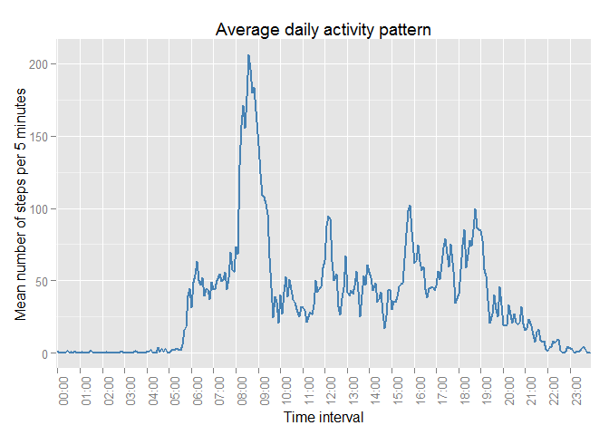

# Reproducible Research: Peer Assessment 1

[repdate-012](https://www.coursera.org/course/repdata) /
[Dmitry B. Grekov](mailto:dmitry.grekov@gmail.com) /
2015-03-12


### Packages 
The following packages were used during this research and are required to reproduce it:  

- `dplyr` - a Grammar of data manipulation
- `lubridate` - make dealing with dates a little easier
- `ggplot2` - an implementation of the Grammar of Graphics

If some of these packages are missing, you have to install them using <code>install.packages()</code> function.  


```r
  suppressPackageStartupMessages(
    {
      library(dplyr)
      library(lubridate)
      library(ggplot2)
    }
  )
```

### Loading and preprocessing the data
<small>**Sidenote.** If the <tt>activity.csv</tt> file doesn't exist in the current directory, we download the archive from the original location on the WEB, unzip and store the file to the working directory. As the assignment instructions say that we may assume that the file is already in the working directory, this is done behind the curtain by an invisible R script.</small>


The raw data from the file is then read into the `dt` variable:

```r
dt <-read.csv("activity.csv", stringsAsFactors=FALSE) %>%
  mutate(
      interval      = sprintf("%04d", interval),
      char.datetime = sprintf("%s %s", date, interval),
      datetime      = ymd_hm(char.datetime),
      hour          = sprintf("%02d", hour(datetime))
    )                                                 %>%
  select (date, interval, hour, steps)
```


### What is mean total number of steps taken per day?
In order to answer this question we need to aggregate the data by `date` and calculate total number of steps per day. Then we calculate total number of steps per day and exclude `NA` values.


```r
dt.daily.total <- dt            %>%
  group_by(date)                %>%
  summarise(value=sum(steps))   %>%
  select(date,value)            %>%
  na.omit()         
```

Here's a histogram for the daily totals:  
 


Mean total number of steps per day equals **10766.19**, median equals **10765**.

### What is the average daily activity pattern?
In order to determine the daily activity pattern we have to we have to calculate the mean total steps over all teh dates grouped by time interval:


```r
dt.timely.total <- dt             %>%
  na.omit()                       %>%
  group_by(hour)                  %>%
  summarise(value=sum(steps))     %>%
  select(hour,value)                
```


Here we build the plot:

```r
  ggplot(dt.timely.total, aes(x=hour, y=value)) +
    geom_point() +
    geom_smooth(aes(group=1),method="loess") 
```

 

### Imputing missing values


### Are there differences in activity patterns between weekdays and weekends?
