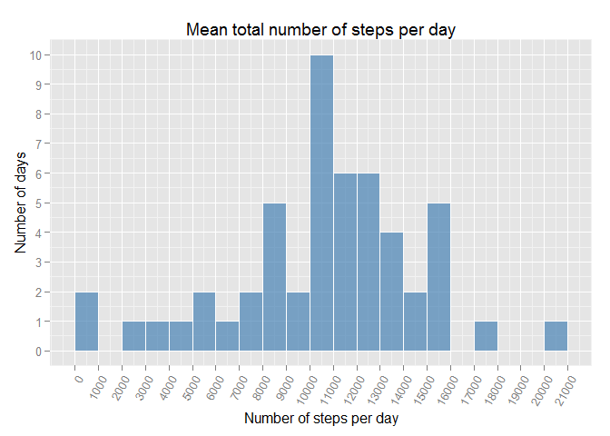
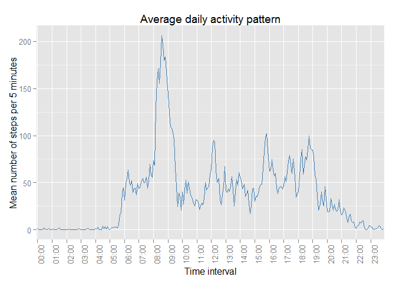
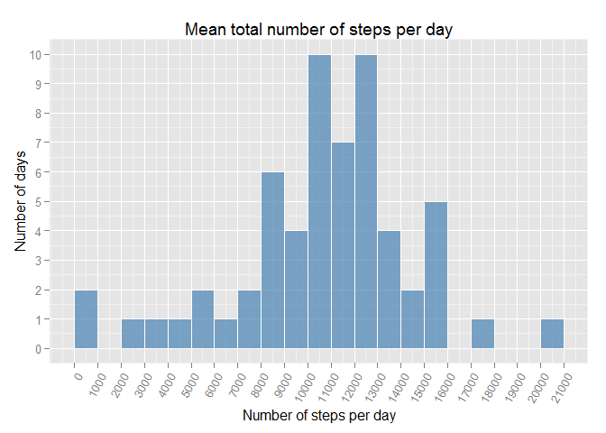
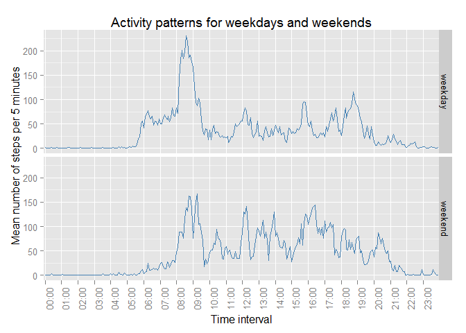

# Reproducible Research: Peer Assessment 1

[repdate-012](https://www.coursera.org/course/repdata) /
[Dmitry B. Grekov](https://www.coursera.org/user/i/ef65e2e142b164e9dab1e980c6e0547d) /
2015-03-15


## Packages 
The following packages were used during this research and are required to reproduce it:  


```r
library(dplyr)      # a Grammar of data manipulation
library(lubridate)  # make dealing with dates a little easier
library(ggplot2)    # an implementation of the Grammar of Graphics
```

If some of these packages are missing, you have first to install them using <code>install.packages()</code> function.  

## Loading and preprocessing the data
The source data is stored in the *activity.csv* file in the working directory. If the file is missing by the time the script starts, it is donloaded from the WEB (this is done behind the curtain).  

The raw data from the file is read into the `dt` variable:

```r
dt <-read.csv("activity.csv", sep=",", stringsAsFactors=FALSE)
```

Right after loading the file we perform some minor transformations: 

- first, convert the `date` variable into `POSIXct` format and interval into *hh:mm* character format:


```r
dt <- mutate(
        dt, 
        date     = ymd(date),                   # POSIXct date
        hh       = floor(interval/100),         # hours
        mm       = interval -  hh*100,          # minutes
        interval = sprintf("%02d:%02d",hh,mm),  # now it is 'hh:mm'
        # eliminate temporary variables as unnecessary 
        hh = NULL, mm = NULL                                
      )
```

- then we create an additional `hour` variable which denotes the hour the time interval belongs to:


```r
dt <- mutate(dt, hour = factor(paste(substr(interval,1,2),"00", sep=":")))
```

## What is mean total number of steps taken per day?
In order to answer this question we have to aggregate the data by date and calculate total number of steps per day. We will also exclude `NA` values during the transformation. The dataset for answering this question will be stored in the `dt.daily` variable: 


```r
dt.daily <- dt %>% na.omit() %>% group_by(date) %>% summarise(value=sum(steps))      
```

Now we can make a histogram of the total number of steps taken each day:

```r
ggplot(dt.daily, aes(x=value)) +
  labs(list(title="Mean total number of steps per day")) + 
  xlab("Number of steps per day")  + 
  ylab("Number of days") + 
  geom_histogram(binwidth=1000, fill="steelblue", color="white", alpha=9/13) +
  scale_x_continuous(breaks=seq(0,21000, by=1000), limits=c(0,21000)) + 
  theme(axis.text.x = element_text(angle=60, hjust= 1)) +
  scale_y_continuous(breaks=0:30) 
```

 

**Question:** Calculate and report the mean and median of the total number of steps taken per day:

```r
c( mean=mean(dt.daily$value), median=median(dt.daily$value))
```

```
##     mean   median 
## 10766.19 10765.00
```

## What is the average daily activity pattern?
In order to determine the daily activity pattern we have to group our data by the time interval and calculate mean number of steps for each interval. We will store the data in `dt.int` variable:


```r
dt.int <- dt %>% na.omit() %>% group_by(interval) %>% summarise(value=mean(steps))
```


Now we can buid a plot showing the daily activity pattern:

```r
ggplot(dt.int, aes(x=interval, y=value, group=1)) + 
  labs(list(title="Average daily activity pattern")) + 
  xlab("Time interval") +
  ylab("Mean number of steps per 5 minutes") + 
  geom_line(color="steelblue") + 
  scale_x_discrete(breaks=levels(dt$hour)) +
  theme(axis.text.x = element_text(angle = 90, hjust = 1))
```

 

**Question**: Which 5-minute interval, on average across all the days in the dataset, contains the maximum number of steps?

```r
dt.int %>% arrange(desc(value)) %>% head(1)
```

```
## Source: local data frame [1 x 2]
## 
##   interval    value
## 1    08:35 206.1698
```

## Imputing missing values
The dataset contains records with missing values which may introduce bias into our calculations. 
Total number of observations with missing values:

```r
sum(is.na(dt$steps))
```

```
## [1] 2304
```

So we need to imput the missing values. Our strategy is quite simple, we just use the rounded mean values from `dt.int` dataset. Such a strategy is powerful enough to provide  good values and easy enough to satisfy the rubric requirements. 

We will store the result in `dt.imp` variable:

```r
dt.imp <- dt %>% inner_join(dt.int, by=c("interval")) %>%
  mutate(steps = ifelse(is.na(steps), round(value), steps))   
```


```r
dt.daily.imp <- dt.imp %>%  group_by(date) %>% summarise(value=sum(steps))      
```

Now let's build a histogram for the daily totals. We will use ggplot plotting system:

```r
ggplot(dt.daily.imp, aes(x=value)) +
  labs(list(title="Mean total number of steps per day (imputed data)")) + 
  xlab("Number of steps per day")  + 
  ylab("Number of days") + 
  geom_histogram(binwidth=1000, fill="steelblue", color="white", alpha=9/13) +
  scale_x_continuous(breaks=seq(0,21000, by=1000), limits=c(0,21000)) + 
  theme(axis.text.x = element_text(angle=60, hjust= 1)) +
  scale_y_continuous(breaks=0:30) 
```

 

**Question**: Calculate and report the mean and median total number of steps taken per day.

```r
c( mean=mean(dt.daily.imp$value), median=median(dt.daily.imp$value))
```

```
##     mean   median 
## 10765.64 10762.00
```
**Question**: Do these values differ from the estimates from the first part of the assignment? What is the impact of imputing missing data on the estimates of the total daily number of steps?  
**Answer:** Both mean and median have slightly changed, but this is ony due to the rounding of the average values, so the overall impact of imputting missing data is minor. Also, the histogram shows that there's now more observations in the mean area (+8 days). 


## Are there differences in activity patterns between weekdays and weekends?
We need to create a new factor variable `day.type` to distinguish between weekdays and weekends:

```r
dt.imp <- dt.imp %>% mutate(
    day.type = factor(ifelse(wday(date) %in% 2:6,1,2),labels=c("weekday","weekend"))
  )
```

In order to draw a plot, we now need our data to be grouped by day types and time intervals:

```r
dt.wd.int <- dt.imp %>% na.omit() %>% group_by(day.type, interval) %>% summarise(value=mean(steps))
```


Now we can compare the paterns for weekdays and weekends using the following plot:

```r
# construct the plot
ggplot(dt.wd.int, aes(x=interval, y=value, group=1)) + 
  labs(list(title="Activity patterns for weekdays and weekends")) +
  xlab("Time interval") + 
  ylab("Mean number of steps per 5 minutes") + 
  geom_line(color="steelblue") +
  facet_grid(day.type~.) + 
  scale_x_discrete(breaks=levels(dt$hour)) + 
  theme(axis.text.x = element_text(angle = 90, hjust = 1))
```

 

As we see on this plot, these patterns really differ. This might be so because the weekdays are *almost* similar to one another and activity during weekends is more random.
