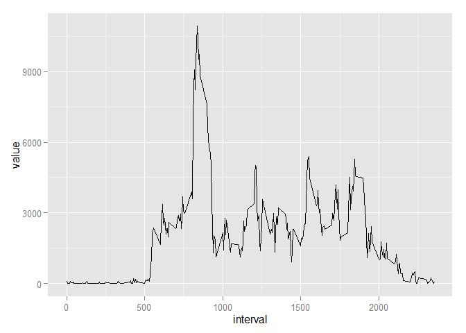

# Reproducible Research: Peer Assessment 1

[repdate-012](https://www.coursera.org/course/repdata) /
[Dmitry B. Grekov](mailto:dmitry.grekov@gmail.com) /
2015-03-11


### Packages 
The following packages were used during this research and are required to reproduce it:  

- `dplyr` - a Grammar of data manipulation
- `ggplot2` - an implementation of the Grammar of Graphics

If some of these packages are missing, you have to install them using <code>install.packages()</code> function.  


### Loading and preprocessing the data
If the `activity.csv` file doesn't exist in the current directory, we download the archive from the original location on the WEB, unzip and store the file to the working directory.  
  - Dataset: [Activity monitoring data](https://d396qusza40orc.cloudfront.net/repdata%2Fdata%2Factivity.zip) [~52K]  


The raw data from the file is then read into the `dt.raw` variable:

```r
dt.raw <- read.csv("activity.csv") 
dt.raw$date <- as.Date(dt.raw$date)
```

### What is mean total number of steps taken per day?
In order to answer this question we need to aggregate the data by `date` and calculate total number of steps per day. Then we calculate total number of steps per day and exclude `NA` values.


```r
dt.daily.total <- dt.raw        %>%
  group_by(date)                %>%
  summarise(value=sum(steps))   %>%
  select(date,value)            %>%
  na.omit()         
```

Here's a histogram fo the daily totals:  
 


Mean total number of steps per day equals **10766.19**, median equals **10765**.

### What is the average daily activity pattern?
In order to determine the daily activity pattern we have to we have to calculate the mean total steps over all teh dates grouped by time interval:


```r
dt.timely.total <- dt.raw         %>%
  na.omit()                       %>%
  group_by(interval)              %>%
  summarise(value=sum(steps))     %>%
  select(interval,value)                

str(dt.timely.total)
```

```
## Classes 'tbl_df', 'tbl' and 'data.frame':	288 obs. of  2 variables:
##  $ interval: int  0 5 10 15 20 25 30 35 40 45 ...
##  $ value   : int  91 18 7 8 4 111 28 46 0 78 ...
##  - attr(*, "drop")= logi TRUE
```


Here we build the plot:

```r
  ggplot(dt.timely.total, aes(x=interval, y=value)) +
    geom_line() +
    geom_smooth(method="lowess")
```

 

### Imputing missing values


### Are there differences in activity patterns between weekdays and weekends?
